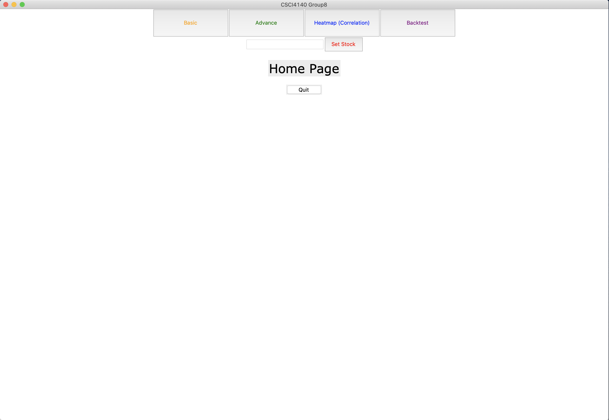
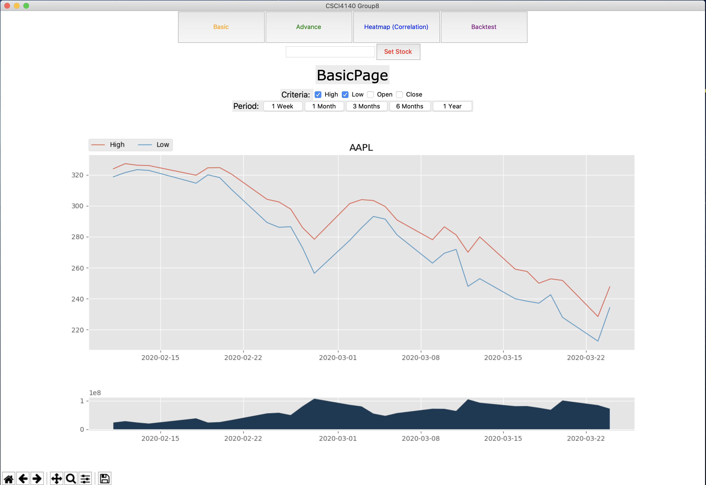
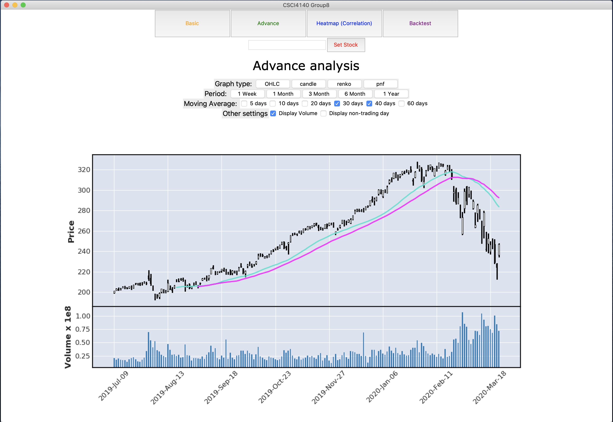
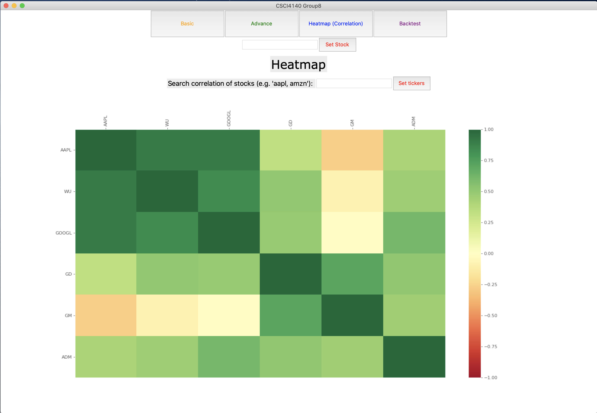
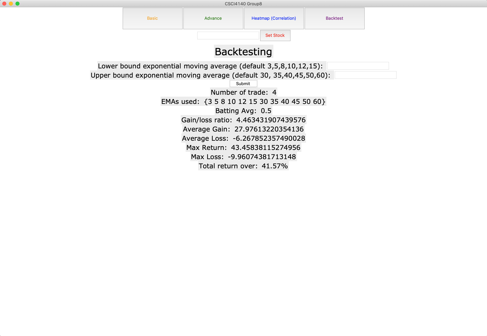

# Algorithmic-Trading-Simulator

- Group: 8
- Team members: LI Kam Po(1155108393). KAM Wing Hang(1155110142)

- Github repo: https://github.com/windWingWalker/Algorithmic-Trading-Simulator
- Warning: This is a pure Python application, we assume you have some basic background knowledge of Python

# Installation

1. Type the following command in your terminal

   `git clone https://github.com/windWingWalker/Algorithmic-Trading-Simulator.git`

2. (Optional) Build your virtual environment

   - We suggest you use `conda` to build a virtual environment, if you have no idea what `conda` do, please read this article https://medium.com/python4u/%E7%94%A8conda%E5%BB%BA%E7%AB%8B%E5%8F%8A%E7%AE%A1%E7%90%86python%E8%99%9B%E6%93%AC%E7%92%B0%E5%A2%83-b61fd2a76566

3. Install following packages

   - tkinter
   - matplotlib
   - pandas
   - pandas-datareader
   - datetime
   - requests
   - beautifulsoup4
   - pickle
   - numpy
   - os
   - mplfinance
     - You may fail to install this package by `conda` (since `conda` did not support it yet)
     - You can try this wonderful approach to install mplfinance https://stackoverflow.com/questions/41060382/using-pip-to-install-packages-to-anaconda-environment
     - If you do not use conda, then you can ignore above two lines

# Run

1. (Optional) Switch to your Python virtual enviroment

2. Type the following command in your terminal

   `python3 gui.py`

# Graphical User Interface

## Home Page

- In home page, you can press `Quit` to close the application
- You can navigate to other page by pressing 4 top buttons. 

- Also, you can set up a ticker (company name) (e.g. AAPL) for further analysis by `Set Stock`. **<u>This ticker will be shared by all pages</u>**. The default value is "AAPL"

## Basic Page

- You can see basic information of the ticker, such as high, low, open, close and volume
- You can also change the period

## Advance Page

- You can choose different type of graphs to show price
- You can also choose more than one moving average to plot 
- You can display volume and non-trading day

## Heatmap (Correlation)

- You can type some tickers search bar and press `Set tickers` 
- The program will show the heatmap (corelation) of typed tickers
- 1 means positive correlation, -1 means negative correlation
- Default values are "AAPL, WU, GOOGL, GD, GM, ADM"

## Backtest

- We provide strategy with exponential moving average
- You can modify the lower bound, upper bound and ticker
- The application will show a list of results based on your input

